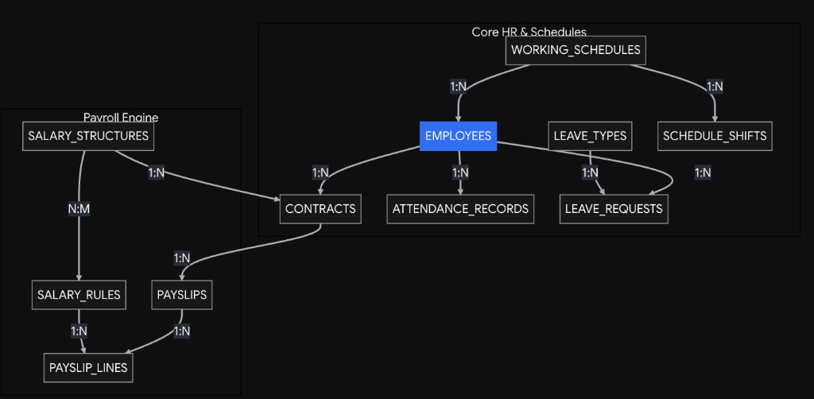
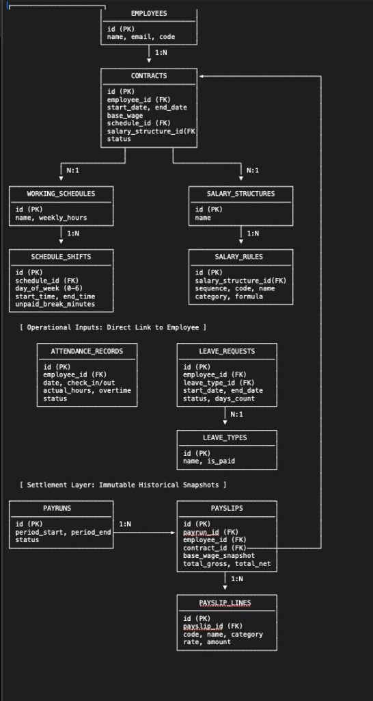
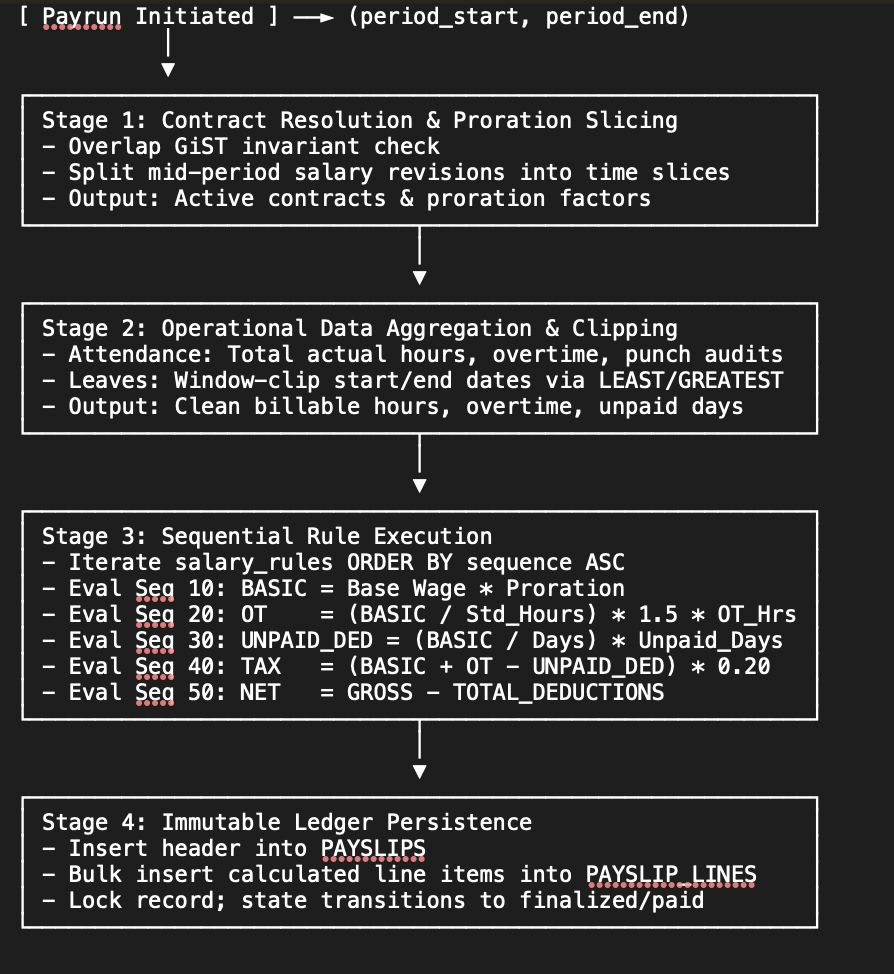

# PeoplePay360: Technical Architecture and Implementation Guide

This guide complements `README.md` by providing technical specifications, database entity definitions, project directory blueprints, and setup guidelines for PeoplePay360.

---

## 1. Technology Stack

### Backend
*   **Language & Framework:** Java 21 / Spring Boot 3.x
*   **Persistence:** Spring Data JPA / Hibernate
*   **Security:** Spring Security with stateless JWT authentication for Role-Based Access Control (RBAC)
*   **Database:** PostgreSQL with transactional integrity (ACID)
*   **Document Generation:** OpenPDF / iText for server-side dynamic Payslip PDF compilation
*   **Email Service:** Spring Boot Starter Mail with asynchronous task execution

### Frontend
*   **Framework:** Next.js (App Router, Server-Side Rendering with hydration safety)
*   **Language:** TypeScript (Strict typing, no `any`)
*   **Styling:** Tailwind CSS v4 using CSS Custom Properties for theme tokens
*   **Iconography:** Lucide Icons (Monochromatic, standardized 1.5px stroke width, zero emojis)
*   **State & Forms:** React Hook Form with Zod schema validation

---

## 2. Database Schema & Relational Models

### System Domain Boundaries


### Relational Schema Architecture


### Core Relational Entities (PostgreSQL)

#### `employees`
*   `id`: UUID (Primary Key)
*   `employee_code`: VARCHAR(30) UNIQUE NOT NULL
*   `first_name`: VARCHAR(50) NOT NULL
*   `last_name`: VARCHAR(50) NOT NULL
*   `work_email`: VARCHAR(100) UNIQUE NOT NULL
*   `work_phone`: VARCHAR(20)
*   `department_id`: UUID (Foreign Key -> `departments.id`)
*   `job_position`: VARCHAR(100) NOT NULL
*   `manager_id`: UUID (Foreign Key -> `employees.id`, Nullable)
*   `working_schedule_id`: UUID (Foreign Key -> `working_schedules.id`)
*   `status`: VARCHAR(20) NOT NULL DEFAULT 'ACTIVE' -- ACTIVE, INACTIVE
*   `bank_account_number`: VARCHAR(50)
*   `bank_ifsc_or_routing`: VARCHAR(30)
*   `tax_id_or_pan`: VARCHAR(30)
*   `created_at`: TIMESTAMP WITH TIME ZONE DEFAULT CURRENT_TIMESTAMP

#### `contracts`
*   `id`: UUID (Primary Key)
*   `contract_reference`: VARCHAR(50) UNIQUE NOT NULL
*   `employee_id`: UUID (Foreign Key -> `employees.id`) NOT NULL
*   `start_date`: DATE NOT NULL
*   `end_date`: DATE -- Nullable for permanent positions
*   `monthly_wage`: NUMERIC(12, 2) NOT NULL
*   `salary_structure_id`: UUID (Foreign Key -> `salary_structures.id`) NOT NULL
*   `status`: VARCHAR(20) NOT NULL DEFAULT 'DRAFT' -- DRAFT, RUNNING, EXPIRED, CANCELLED
*   `created_at`: TIMESTAMP WITH TIME ZONE DEFAULT CURRENT_TIMESTAMP
*   *Constraint:* An employee cannot possess multiple concurrent contracts with status `RUNNING` where date intervals overlap.

#### `working_schedules`
*   `id`: UUID (Primary Key)
*   `name`: VARCHAR(100) NOT NULL
*   `weekly_hours`: NUMERIC(5, 2) NOT NULL -- Dynamically computed
*   `created_at`: TIMESTAMP WITH TIME ZONE DEFAULT CURRENT_TIMESTAMP

#### `working_schedule_lines`
*   `id`: UUID (Primary Key)
*   `schedule_id`: UUID (Foreign Key -> `working_schedules.id`) NOT NULL
*   `day_of_week`: INTEGER NOT NULL -- 1 (Monday) to 7 (Sunday)
*   `start_time`: TIME NOT NULL
*   `end_time`: TIME NOT NULL
*   `break_minutes`: INTEGER DEFAULT 0

#### `attendance_records`
*   `id`: UUID (Primary Key)
*   `employee_id`: UUID (Foreign Key -> `employees.id`) NOT NULL
*   `date`: DATE NOT NULL
*   `check_in`: TIMESTAMP WITH TIME ZONE NOT NULL
*   `check_out`: TIMESTAMP WITH TIME ZONE
*   `worked_hours`: NUMERIC(5, 2)
*   `status`: VARCHAR(20) NOT NULL DEFAULT 'PRESENT' -- PRESENT, LATE, EXCEPTION
*   `manual_override`: BOOLEAN DEFAULT FALSE
*   `modified_by`: UUID (Foreign Key -> `employees.id`, Nullable)
*   `override_reason`: TEXT

#### `time_off_types`
*   `id`: UUID (Primary Key)
*   `name`: VARCHAR(50) NOT NULL
*   `unit`: VARCHAR(10) NOT NULL DEFAULT 'DAYS' -- DAYS, HOURS
*   `allocation_required`: BOOLEAN DEFAULT TRUE
*   `payroll_affecting`: BOOLEAN DEFAULT FALSE -- Unpaid vs Paid leave

#### `time_off_allocations`
*   `id`: UUID (Primary Key)
*   `employee_id`: UUID (Foreign Key -> `employees.id`) NOT NULL
*   `time_off_type_id`: UUID (Foreign Key -> `time_off_types.id`) NOT NULL
*   `allocated_days`: NUMERIC(5, 2) NOT NULL
*   `valid_from`: DATE NOT NULL
*   `valid_to`: DATE NOT NULL
*   `status`: VARCHAR(20) NOT NULL DEFAULT 'DRAFT' -- DRAFT, APPROVED, REFUSED
*   `approved_by`: UUID (Foreign Key -> `employees.id`, Nullable)

#### `time_off_requests`
*   `id`: UUID (Primary Key)
*   `employee_id`: UUID (Foreign Key -> `employees.id`) NOT NULL
*   `time_off_type_id`: UUID (Foreign Key -> `time_off_types.id`) NOT NULL
*   `start_date`: DATE NOT NULL
*   `end_date`: DATE NOT NULL
*   `duration`: NUMERIC(5, 2) NOT NULL
*   `status`: VARCHAR(20) NOT NULL DEFAULT 'PENDING' -- PENDING, APPROVED, REFUSED
*   `approved_by`: UUID (Foreign Key -> `employees.id`, Nullable)
*   `rejection_reason`: TEXT

#### `salary_structures`
*   `id`: UUID (Primary Key)
*   `name`: VARCHAR(100) NOT NULL
*   `description`: TEXT
*   `is_active`: BOOLEAN DEFAULT TRUE

#### `salary_rules`
*   `id`: UUID (Primary Key)
*   `structure_id`: UUID (Foreign Key -> `salary_structures.id`) NOT NULL
*   `name`: VARCHAR(100) NOT NULL
*   `code`: VARCHAR(30) NOT NULL -- BASIC, HRA, GROSS, PF, NET
*   `category`: VARCHAR(30) NOT NULL -- BASIC, ALLOWANCE, GROSS, DEDUCTION, NET
*   `sequence`: INTEGER NOT NULL -- Execution order (10, 20, 30, ...)
*   `computation_type`: VARCHAR(20) NOT NULL -- FIXED, PERCENTAGE, FORMULA
*   `amount_or_percentage`: NUMERIC(10, 2)
*   `formula_expression`: TEXT -- e.g., 'BASIC * 0.40' or 'GROSS - TOTAL_DEDUCTIONS'

#### `payruns`
*   `id`: UUID (Primary Key)
*   `reference`: VARCHAR(50) UNIQUE NOT NULL -- e.g., PAY/2026/09
*   `salary_structure_id`: UUID (Foreign Key -> `salary_structures.id`) NOT NULL
*   `period_start`: DATE NOT NULL
*   `period_end`: DATE NOT NULL
*   `status`: VARCHAR(20) NOT NULL DEFAULT 'DRAFT' -- DRAFT, COMPUTED, VALIDATED, PAID
*   `total_gross_disbursed`: NUMERIC(14, 2) DEFAULT 0
*   `total_net_disbursed`: NUMERIC(14, 2) DEFAULT 0
*   `created_at`: TIMESTAMP WITH TIME ZONE DEFAULT CURRENT_TIMESTAMP

#### `payslips`
*   `id`: UUID (Primary Key)
*   `payrun_id`: UUID (Foreign Key -> `payruns.id`) NOT NULL
*   `employee_id`: UUID (Foreign Key -> `employees.id`) NOT NULL
*   `contract_id`: UUID (Foreign Key -> `contracts.id`) NOT NULL
*   `worked_days`: NUMERIC(5, 2) NOT NULL
*   `gross_salary`: NUMERIC(12, 2) NOT NULL
*   `total_deductions`: NUMERIC(12, 2) NOT NULL
*   `net_salary`: NUMERIC(12, 2) NOT NULL
*   `status`: VARCHAR(20) NOT NULL DEFAULT 'DRAFT' -- DRAFT, COMPUTED, VALIDATED, PAID

#### `payslip_lines`
*   `id`: UUID (Primary Key)
*   `payslip_id`: UUID (Foreign Key -> `payslips.id`) NOT NULL
*   `rule_code`: VARCHAR(30) NOT NULL
*   `rule_name`: VARCHAR(100) NOT NULL
*   `category`: VARCHAR(30) NOT NULL
*   `sequence`: INTEGER NOT NULL
*   `amount`: NUMERIC(12, 2) NOT NULL

---

### Payrun Execution Engine Pipeline


---

## 3. Project Directory Blueprint

```text
PeoplePay360/
├── backend/
│   ├── src/main/java/com/peoplepay360/
│   │   ├── config/
│   │   │   ├── SecurityConfig.java
│   │   │   ├── WebMvcConfig.java
│   │   │   └── OpenApiConfig.java
│   │   ├── controllers/
│   │   │   ├── AuthController.java
│   │   │   ├── EmployeeController.java
│   │   │   ├── ContractController.java
│   │   │   ├── AttendanceController.java
│   │   │   ├── TimeOffController.java
│   │   │   ├── PayrunController.java
│   │   │   └── DashboardController.java
│   │   ├── dto/
│   │   │   ├── requests/
│   │   │   └── responses/
│   │   ├── entities/
│   │   │   ├── Employee.java
│   │   │   ├── Contract.java
│   │   │   ├── WorkingSchedule.java
│   │   │   ├── AttendanceRecord.java
│   │   │   ├── TimeOffAllocation.java
│   │   │   ├── TimeOffRequest.java
│   │   │   ├── SalaryStructure.java
│   │   │   ├── SalaryRule.java
│   │   │   ├── Payrun.java
│   │   │   ├── Payslip.java
│   │   │   └── PayslipLine.java
│   │   ├── exceptions/
│   │   │   ├── GlobalExceptionHandler.java
│   │   │   └── ResourceNotFoundException.java
│   │   ├── repositories/
│   │   │   ├── EmployeeRepository.java
│   │   │   ├── ContractRepository.java
│   │   │   ├── AttendanceRepository.java
│   │   │   ├── TimeOffRepository.java
│   │   │   └── PayrunRepository.java
│   │   └── services/
│   │       ├── PayrollEngineService.java
│   │       ├── LeaveAllocationService.java
│   │       ├── PdfGenerationService.java
│   │       └── EmailDispatchService.java
│   └── pom.xml
│
├── frontend/
│   ├── src/
│   │   ├── app/
│   │   │   ├── layout.tsx
│   │   │   ├── page.tsx
│   │   │   ├── (auth)/
│   │   │   │   └── login/page.tsx
│   │   │   ├── employees/
│   │   │   │   ├── page.tsx
│   │   │   │   └── [id]/page.tsx
│   │   │   ├── contracts/
│   │   │   │   ├── page.tsx
│   │   │   │   └── [id]/page.tsx
│   │   │   ├── attendance/
│   │   │   │   └── page.tsx
│   │   │   ├── time-off/
│   │   │   │   ├── requests/page.tsx
│   │   │   │   └── allocations/page.tsx
│   │   │   ├── payroll/
│   │   │   │   ├── payruns/
│   │   │   │   │   ├── page.tsx
│   │   │   │   │   └── [id]/page.tsx
│   │   │   │   ├── payslips/page.tsx
│   │   │   │   └── configuration/page.tsx
│   │   │   └── dashboard/
│   │   │       └── page.tsx
│   │   ├── components/
│   │   │   ├── layout/
│   │   │   │   ├── Navbar.tsx
│   │   │   │   └── Breadcrumb.tsx
│   │   │   ├── common/
│   │   │   │   ├── SmartButtons.tsx
│   │   │   │   ├── PipelineHeader.tsx
│   │   │   │   ├── Table.tsx
│   │   │   │   └── StatusBadge.tsx
│   │   │   ├── employees/
│   │   │   │   ├── EmployeeKanban.tsx
│   │   │   │   └── EmployeeForm.tsx
│   │   │   └── payroll/
│   │   │       ├── PayrunWizard.tsx
│   │   │       └── WarningBox.tsx
│   │   ├── config/
│   │   │   ├── routes.ts      # Central route mapping
│   │   │   └── api.ts         # Central API endpoints
│   │   ├── lib/
│   │   │   └── apiClient.ts
│   │   └── types/
│   │       └── index.ts
│   ├── tsconfig.json
│   └── package.json
│
├── docs/
│   └── database/
│       ├── assets/
│       │   ├── 01_relational_entity_spine.png
│       │   └── 05_proration_pipeline_simulator.png
│       ├── 01_relational_entity_spine.md
│       ├── 02_temporal_slicing_boundary_clipping.md
│       ├── 03_sequential_rule_evaluation_pipeline.md
│       ├── 04_concurrency_worker_queue_immutability_guard.md
│       ├── 05_proration_pipeline_simulator.md
│       └── README.md
│
├── README.md
└── .gitignore
```

---

## 4. Architectural Rules & Best Practices

1.  **Strict Transaction Boundaries:** Database operations affecting multiple tables (e.g., approving leave and debiting the allocation ledger, or finalizing a payrun and generating payslip lines) must run inside atomic database transactions (`@Transactional`).
2.  **No Direct Float for Currency:** All financial amounts (wages, allowances, deductions, net salary) must use `NUMERIC` or `BigDecimal` to prevent IEEE 754 floating-point rounding inaccuracies.
3.  **Auditability:** Modifying operational records (e.g., attendance manual overrides) must record the operator's user reference and reason.
4.  **Zero-Emoji Standard:** All UI components, terminal logs, and commit messages must remain strictly devoid of emojis, using monochromatic SVG icons exclusively.
