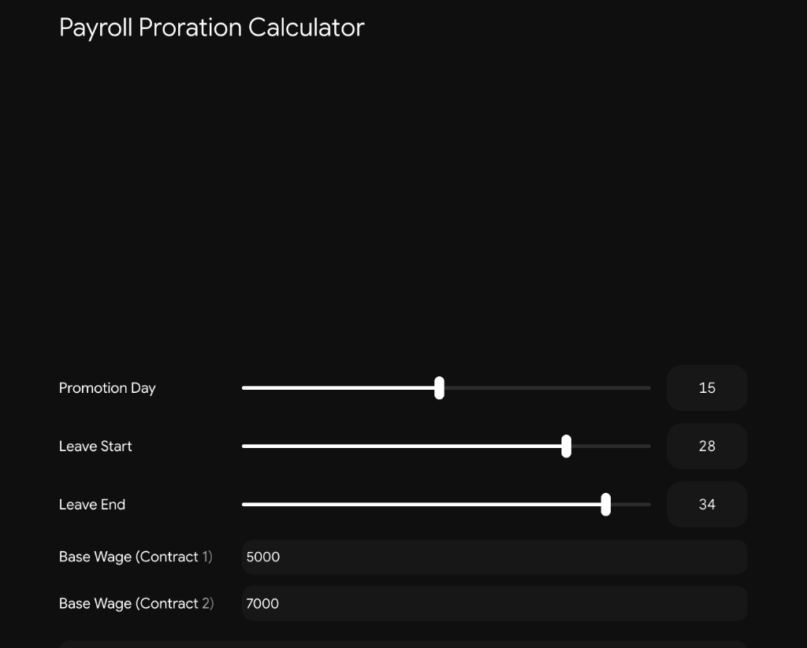

# 5. Interactive Proration & Pipeline Simulator

The interactive simulator models dynamic temporal inputs, allowing payroll administrators and backend engineers to simulate complex multi-contract proration and cross-month leave deductions.

---

## Simulator Parameter Inputs

| Parameter | Type / Control | Example Value | Description |
| :--- | :--- | :--- | :--- |
| **Promotion Day** | Slider $[1 - 30]$ | `15` | Day of the month where Contract 1 terminates and Contract 2 becomes effective. |
| **Leave Start** | Slider $[1 - 31]$ | `28` | Start calendar day of an employee's requested time off. |
| **Leave End** | Slider $[1 - 45]$ | `34` | End day of requested leave (values $>30$ represent next-cycle spillover). |
| **Base Wage (Contract 1)** | Numeric Input | `$5,000` | Historical monthly compensation governing Slice 1. |
| **Base Wage (Contract 2)** | Numeric Input | `$7,000` | Revised monthly compensation governing Slice 2. |

---

## Test Vector Derivations

### Scenario: Mid-Period Promotion with Cross-Cycle Unpaid Absence

#### 1. Contract Slicing Calculation (30-day Cycle)
* **Contract 1 Interval:** $[Day\ 1, Day\ 14]$ (14 active days)
  $$\text{Slice 1 Base} = \$5,000 \times \left(\frac{14}{30}\right) = \$2,333.33$$
* **Contract 2 Interval:** $[Day\ 15, Day\ 30]$ (16 active days)
  $$\text{Slice 2 Base} = \$7,000 \times \left(\frac{16}{30}\right) = \$3,733.33$$
* **Total Blended Base Wage:**
  $$\text{Blended Base} = \$2,333.33 + \$3,733.33 = \$6,066.66$$

---

#### 2. Cross-Month Leave Window Clipping
* **Requested Window:** Day 28 to Day 34 (7 calendar days total).
* **Current Cycle Active Window:** $[Day\ 28, Day\ 30]$
  $$\text{Current Cycle Deductible Days} = \min(34, 30) - \max(28, 1) + 1 = 30 - 28 + 1 = 3\text{ days}$$
* **Next Cycle Spillover:** $[Day\ 31, Day\ 34]$
  $$\text{Next Cycle Deductible Days} = 34 - 31 + 1 = 4\text{ days}$$
* **Unpaid Deduction on Blended Base:**
  $$\text{Daily Rate} = \frac{\$6,066.66}{30} = \$202.22$$
  $$\text{Unpaid Leave Deduction (Current Cycle)} = \$202.22 \times 3 = \$606.66$$

---

## Architectural Purpose
This simulator validates that backend database constraints and SQL query execution match business logic expectations under real-world temporal edge cases before committing payruns to immutable persistence.
