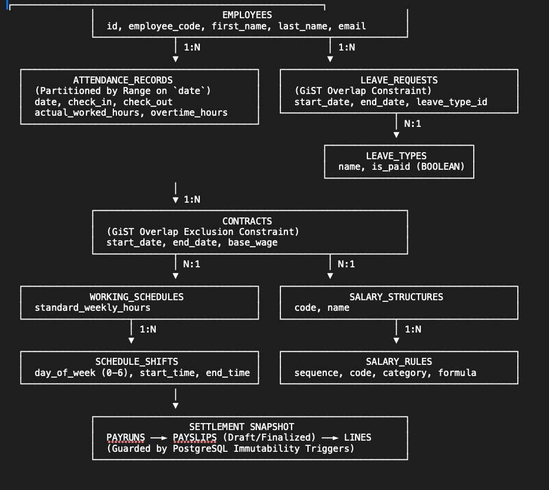

# 1. Relational Entity Spine & Storage Separation

Operational logs (attendance, time off) flow into contract-governed salary templates, terminating in an immutable financial ledger.



---

## Architecture Diagram

```text
┌────────────────────────────────────────────────────────┐
│                       EMPLOYEES                        │
│  id, employee_code, first_name, last_name, email       │
└──────────────┬───────────────────────────┬─────────────┘
               │ 1:N                       │ 1:N
               ▼                           ▼
┌──────────────────────────────────────────┐   ┌──────────────────────────────────────────┐
│         ATTENDANCE_RECORDS               │   │              LEAVE_REQUESTS              │
│  (Partitioned by Range on `date`)        │   │  (GiST Overlap Constraint)               │
│  date, check_in, check_out               │   │  start_date, end_date, leave_type_id     │
│  actual_worked_hours, overtime_hours     │   └────────────────────┬─────────────────────┘
└──────────────────────────────────────────┘                        │ N:1
                                                                    ▼
                                                       ┌──────────────────────────┐
                                                       │       LEAVE_TYPES        │
                                                       │  name, is_paid (BOOLEAN) │
                                                       └──────────────────────────┘
               │
               ▼ 1:N
┌────────────────────────────────────────────────────────┐
│                       CONTRACTS                        │
│  (GiST Overlap Exclusion Constraint)                   │
│  start_date, end_date, base_wage                       │
└──────────────┬───────────────────────────┬─────────────┘
               │ N:1                       │ N:1
               ▼                           ▼
┌──────────────────────────────────────────┐   ┌──────────────────────────────────────────┐
│            WORKING_SCHEDULES             │   │            SALARY_STRUCTURES             │
│  standard_weekly_hours                   │   │  code, name                              │
└───────────────────┬──────────────────────┘   └────────────────────┬─────────────────────┘
                    │ 1:N                                           │ 1:N
                    ▼                                               ▼
┌──────────────────────────────────────────┐   ┌──────────────────────────────────────────┐
│             SCHEDULE_SHIFTS              │   │               SALARY_RULES               │
│  day_of_week (0-6), start_time, end_time │   │  sequence, code, category, formula       │
└──────────────────────────────────────────┘   └──────────────────────────────────────────┘
               │
               ▼
┌────────────────────────────────────────────────────────┐
│                 SETTLEMENT SNAPSHOT                    │
│  PAYRUNS ──► PAYSLIPS (Draft/Finalized) ──► LINES      │
│  (Guarded by PostgreSQL Immutability Triggers)         │
└────────────────────────────────────────────────────────┘
```

---

## Architectural Breakdown

### 1. Central Entity Anchor (`EMPLOYEES`)
* Serves as the primary operational anchor across HR and Payroll domains.
* Direct 1:N relational links to operational logs (`attendance_records`, `leave_requests`) and legal employment terms (`contracts`).

### 2. Operational Ingestion Layer
* **`attendance_records` (Partitioned by Range on `date`):** Partitioned tables optimize scan efficiency across multi-year timesheet histories and high-frequency punch ingestion.
* **`leave_requests` (GiST Overlap Constraint):** Uses PostgreSQL generalized search tree (GiST) constraints on date ranges (`daterange(start_date, end_date, '[]')`) to prevent overlapping leave intervals for the same employee.
* **`leave_types`:** Governs payroll deduction flags via `is_paid` (BOOLEAN).

### 3. Contract Governance & Compensation Template Layer
* **`contracts` (GiST Overlap Exclusion Constraint):** Prevents concurrent active contracts for an employee over overlapping temporal ranges.
* **`working_schedules` & `schedule_shifts`:** Define scheduled weekly patterns and standard shift hours for attendance deficit and overtime calculations.
* **`salary_structures` & `salary_rules`:** Ordered evaluation rules (sequence, code, category, formula) driving deterministic payroll computation.

### 4. Settlement Layer & Immutable Ledger Persistence
* **`payruns` ──► `payslips` ──► `payslip_lines`:** Captures frozen financial records for a given pay cycle.
* **PostgreSQL Immutability Triggers:** Enforce strict write-once semantics on finalized payslips, blocking unauthorized `UPDATE` and `DELETE` events to guarantee PDF and financial ledger parity.
